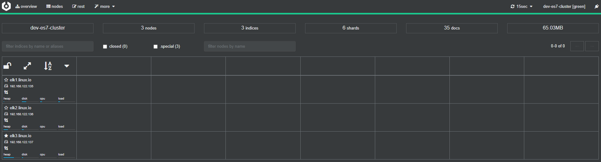
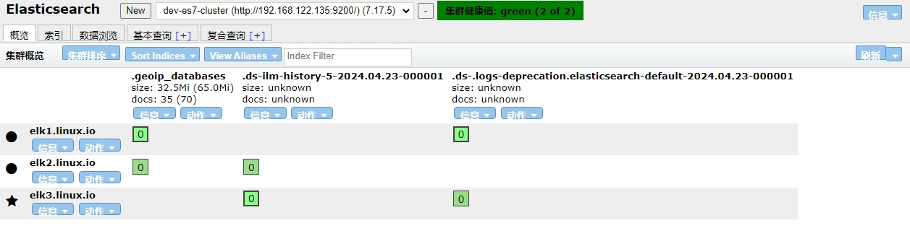

# 日志采集
<!-- > <https://github.com/tchapi/markdown-cheatsheet> -->
- - - -

## elasticsearch

elasticsearch 是一个高度可扩展的开源全文搜索和分析引擎，它可实现数据的实时全文搜索、支持分布式可实现高可用、提供 API 接口，可以处理大规模日志数据，比如 Nginx、Tomcat、系统日志等功能。Elasticsearch 使用 Java 语言开发，是建立在全文搜索引擎 Apache Lucene 基础之上的搜索引擎。

Elasticsearch 的特点
- 实时搜索、实时分析
- 分布式架构、实时文件存储
- 文档导向，所有对象都是文档
- 高可用，易扩展，支持集群，分片与复制
- 接口友好，支持 json

### 单点安装

**rpm 安装**

- 下载软件包 

```
wget https://mirrors.tuna.tsinghua.edu.cn/elasticstack/7.x/yum/7.17.5/elasticsearch-7.17.5-x86_64.rpm
```

- 安装

```
yum localinstall -y ./elasticsearch-7.17.5-x86_64.rpm 
```

- 准备日志目录和数据目录

```
install -d /data/apps/es7/{data,logs} -o elasticsearch -g elasticsearch
```

- 配置

```
vim /etc/elasticsearch/elasticsearch.yml
node.name: elk1.linux.io
path.data: /data/apps/es7/data
path.logs: /data/apps/es7/logs
network.host: 192.168.122.135
discovery.seed_hosts: ["elk1.linux.io"]
```

- 启动服务

```
systemctl  enable elasticsearch --now
```

- 验证

```
curl elk1.linux.io:9200
{
  "name" : "elk1.linux.io",
  "cluster_name" : "elasticsearch",
  "cluster_uuid" : "lO8uc1IrQAyBKR5579r8OA",
  "version" : {
    "number" : "7.17.5",
    "build_flavor" : "default",
    "build_type" : "rpm",
    "build_hash" : "8d61b4f7ddf931f219e3745f295ed2bbc50c8e84",
    "build_date" : "2022-06-23T21:57:28.736740635Z",
    "build_snapshot" : false,
    "lucene_version" : "8.11.1",
    "minimum_wire_compatibility_version" : "6.8.0",
    "minimum_index_compatibility_version" : "6.0.0-beta1"
  },
  "tagline" : "You Know, for Search"
}
```


**预编译二进制安装**

- 下载软件包

```
wget https://artifacts.elastic.co/downloads/elasticsearch/elasticsearch-7.17.5-linux-x86_64.tar.gz
```

- 解压

```
tar -xf elasticsearch-7.17.5-linux-x86_64.tar.gz  -C /data/apps/
cd /data/apps/ 
ln -sv elasticsearch-7.17.5/ elasticsearch
```

- 准备日志目录和数据目录

```
useradd   elastic
install -d /data/apps/elasticsearch/{data,logs} -o elastic -g elastic
```

- 配置

```
vim /data/apps/elasticsearch/config/elasticsearch.yml 
node.name: elk2.linux.io
path.data: /data/apps/elasticsearch/data
path.logs: /data/apps/elasticsearch/logs
network.host: 192.168.122.136
discovery.seed_hosts: ["elk2.linux.io"]
```

- 启动服务

```
chown -R elastic.elastic /data/apps/elasticsearch 
chown -R elastic.elastic /data/apps/elasticsearch-7.17.5/
su - elastic -c '/data/apps/elasticsearch-7.17.5/bin/elasticsearch -d'  
```


- 验证

```
curl elk2.linux.io:9200
{
  "name" : "elk2.linux.io",
  "cluster_name" : "elasticsearch",
  "cluster_uuid" : "Dw5L0Fb5Ska6RomQhspT2Q",
  "version" : {
    "number" : "7.17.5",
    "build_flavor" : "default",
    "build_type" : "tar",
    "build_hash" : "8d61b4f7ddf931f219e3745f295ed2bbc50c8e84",
    "build_date" : "2022-06-23T21:57:28.736740635Z",
    "build_snapshot" : false,
    "lucene_version" : "8.11.1",
    "minimum_wire_compatibility_version" : "6.8.0",
    "minimum_index_compatibility_version" : "6.0.0-beta1"
  },
  "tagline" : "You Know, for Search"
}
```


### 集群安装

| 主机名 | IP 地址 |
| ---- | ---- |
| elk1.linux.io | 192.168.122.135 |
| elk2.linux.io | 192.168.122.136 |
| elk3.linux.io | 192.168.122.137 |

- 主机名解析

```
cat >> /etc/hosts <<'EOF'
192.168.122.135 elk1.linux.io
192.168.122.136 elk2.linux.io
192.168.122.137 elk3.linux.io
EOF
```

- 所有节点针对ES基础调优

```
cat > /etc/security/limits.d/es7.conf <<EOF
*       soft    nofile  65535
*       hard    nofile  131070
*       hard    nproc   8192
EOF

echo  "vm.max_map_count=524288" >> /etc/sysctl.d/es.conf
```

- 所有节点解压安装包

```
tar -xf elasticsearch-7.17.5-linux-x86_64.tar.gz  -C /data/apps/
```

- 所有节点创建运行ES服务的用户和数据目录

```
useradd  elastic
install -d /data/apps/elasticsearch-7.17.5/{data,logs} -o elastic -g elastic
chown -R elastic.elastic /data/apps/elasticsearch-7.17.5
```

- 配置
```
vim /data/apps/elasticsearch-7.17.5/config/elasticsearch.yml 
cluster.name: dev-es7-cluster # 所有节点保持一致
node.name: elk1.linux.io # 修改为各自的主机名
path.data: /data/apps/elasticsearch-7.17.5/data
path.logs: /data/apps/elasticsearch-7.17.5/logs
network.host: 0.0.0.0 # 如果有多块网卡，请明确指定IP
discovery.seed_hosts: ["elk1.linux.io", "elk2.linux.io", "elk3.linux.io"]
cluster.initial_master_nodes: ["elk1.linux.io", "elk2.linux.io", "elk3.linux.io"]
```


- 使用Unit风格管理服务

```
cat > /usr/lib/systemd/system/es7.service <<EOF
[Unit]
Description=dev service es7
After=network.target

[Service]
Type=simple
Environment=ES_HOME=/data/apps/elasticsearch-7.17.5/jdk/
Environment=ES_PATH_CONF=data/apps/elasticsearch-7.17.5/config
ExecStart=/data/apps/elasticsearch-7.17.5/bin/elasticsearch
User=elastic
Group=elastic
LimitNOFILE=131070
LimitNPROC=4096

[Install]
WantedBy=multi-user.target
EOF
systemctl  daemon-reload
systemctl  enable es7 --now
```

- 验证

```
curl elk2.linux.io:9200
{
  "name" : "elk2.linux.io",
  "cluster_name" : "dev-es7-cluster",  # 
  "cluster_uuid" : "0Efxhjq_S5uddZfIPLXLqQ", # 确保所有节点都一致
  "version" : {
    "number" : "7.17.5",
    "build_flavor" : "default",
    "build_type" : "tar",
    "build_hash" : "8d61b4f7ddf931f219e3745f295ed2bbc50c8e84",
    "build_date" : "2022-06-23T21:57:28.736740635Z",
    "build_snapshot" : false,
    "lucene_version" : "8.11.1",
    "minimum_wire_compatibility_version" : "6.8.0",
    "minimum_index_compatibility_version" : "6.0.0-beta1"
  },
  "tagline" : "You Know, for Search"
}
curl elk2.linux.io:9200/_cat/nodes
192.168.122.137 42 96  0 0.02 0.07 0.15 cdfhilmrstw * elk3.linux.io
192.168.122.136 20 91  8 0.21 0.24 0.33 cdfhilmrstw - elk2.linux.io
192.168.122.135  7 97 10 0.21 0.39 0.74 cdfhilmrstw - elk1.linux.io
```

### 启动失败解决方案

- 报错：`max file descriptors [4096] for elasticsearch process is too low, increase to at least [65535]`
- 解决方案：修改文件打开数量上线，修改后需要断开会话 
```
vim /etc/security/limits.d/es7.conf
*	soft	nofile	65535
*	hard	nofile	131070
*	hard	nproc	8192

ulimit -Sn
65535
ulimit -Hn
131070
```

- 报错： `max virtual memory areas vm.max_map_count [65530] is too low, increase to at least [262144]`
- 解决方案： 调大内核虚拟内存映射值

```
vim /etc/sysctl.d/es.conf
vm.max_map_count=524288

sysctl -f  /etc/sysctl.d/es.conf
sysctl -q vm.max_map_count      
vm.max_map_count = 524288
```

- 报错：`java.net.UnknownHostException: elk2.linux.io`
- 解决办法：hosts文件主机名添加解析

- 报错：`"cluster_uuid" : "_na_",`
- 解决办法：停止进程，然后删除脏数据，添加配置 cluster.initial_master_nodes，重新启动服务

```
# 删除脏数据，可不操作，仅适用于新集群
pkill -9 java
rm -rf /data/apps/elasticsearch/{data/*,logs/*}
cluster.initial_master_nodes: ["elk2.linux.io"]
```

### Cerebro 管理程序

> 官网： https://github.com/lmenezes/cerebro

Cerebro 是一个开源的elsticsearch web 管理工具 ，需要 java1.8 或者更高版本。

- 下载

```
wget https://github.com/lmenezes/cerebro/releases/download/v0.8.1/cerebro-0.8.1.tgz
```

- 安装

```
 tar -xf cerebro-0.8.1.tgz -C /data/apps
```

- 配置

```
 cd /data/apps/cerebro-0.8.1/
vim conf/application.conf 
'''
auth = {
  type: basic
    settings: {
      username = "admin"
      password = "1234"
    }
}
...
hosts = [
  {
    host = "http://192.168.122.135:9200"
    name = "dev-es7-cluster"
  #  headers-whitelist = [ "x-proxy-user", "x-proxy-roles", "X-Forwarded-For" ]
  }
  # Example of host with authentication
  #{
  #  host = "http://some-authenticated-host:9200"
  #  name = "Secured Cluster"
  #  auth = {
  #    username = "username"
  #    password = "secret-password"
  #  }
  #}
]
```

- 启动服务

```
nohup ./bin/cerebro &
```

- 访问web

默认的访问地址为：http://IP:9000




### Elasticsearch相关术语


**MySQL跟ElasticSearch对比**

| Elasticsearch	 | MySQL |
| --- | --- |
| Index（索引）| 	Datobase（数据库）| 
| Type（类型）	| Table（数据表）| 
| Document（文档）| 	Row（行）| 
| Mapping | 	Schema| 
| Fields（字段）	| Column（列）| 

1. index（索引）: 一个索引就是一个拥有几分相似特征的文档的集合
2. type（类型）: 一个类型是索引的一个逻辑上的分类/分区,个索引中可以定义一种或多种类型
3. document（文档）: 文档是一个可被索引的基础信息单元，也就是一条数据。相当于MySQL中的一条记录
4. field（字段）: 对文档数据根据不同属性进行的分类标识
5. mapping（映射）: mapping是处理数据的方式和规则方面做一些限制，如某个字段的数据类型、默认值、分析器、是否被索引等
6. cluster（集群）: 一个集群就是由一个或多个节点组织在一起，它们共同持有整个的数据，并一起提供索引和搜索功能。
7. node（节点）: 一个节点是集群中的一个服务器，作为集群的一部分，它存储数据，参与集群的索引和搜索功能。
8.  shard（分片）: 提供了将索引划分成多份的能力，这些份就叫做分片，允许你在分片之上进行分布式的、并行的操作，进而*提高性能/吞吐量*
9. replicas（副本）： 创建分片的一份或多份备份，这些备份叫做复制分片，或者直接叫副本。在分片/节点失败的情况下，提供了*高可用性*
10. allocation（分配）： 将分片分配给某个节点的过程，包括分配主分片或者副本。如果是副本，还包含从主分片复制数据的过程。这个过程是由master节点完成的。

**集群状态**



- green: 表示所有的主分片和副本分片均正常工作
- yellow： 表示部分副本分片不正常
- red： 表示有部分主分片不正常工作

### 索引相关操作

> [官网](https://www.elastic.co/guide/en/elasticsearch/reference/current/indices.html): https://www.elastic.co/guide/en/elasticsearch/reference/current/indices.html

**创建索引**

- 创建默认索引(不指定分片和副本，默认为一个分片一个副本)
```
curl -X PUT http://elk1.linux.io:9200/dev-index-00 
```
> 索引名称建议不要出现以`.`、`_`、—`开头，索引名册不能出现大写。必须小写

- 创建指定(5个)分片和（2个副本）副本的索引
```
curl -X PUT 'http://elk1.linux.io:9200/dev-index-04' -H 'Content-Type: application/json' -d '{
    "settings": {
        "index": {
            "number_of_shards": 5,
            "number_of_replicas": 3 
        }
    }
}'
{"acknowledged":true,"shards_acknowledged":true,"index":"dev-index-03"}
```
> 副本数不应该小于集群节点数，否则集群会处于yellow状态

**修改索引**
```
curl -X PUT 'http://elk1.linux.io:9200/dev-index-04/_settings'  -H 'Content-Type: application/json' -d  '{
    "settings": {
        "index": {
            "number_of_replicas": 2 
        }
    }
}'
```
> 可修改索引的副本数，但是不能动态修改分片数。

**查看索引**

- 查看所有索引
```
curl -X GET http://elk1.linux.io:9200/_cat/indices?v
health status index            uuid                   pri rep docs.count docs.deleted store.size pri.store.size
green  open   .geoip_databases ANg7J6ZfTPq6qyZ9K7MmoA   1   1         35            0       65mb         32.5mb
green  open   dev-index-01     cvRDzENCRtuaGievH2wo9g   1   1          0            0       452b           226b
green  open   dev-index-00     drO789YOT_GoKHV_sLwEyw   1   1          0            0       452b           226b
```

- 查看单个索引
```

```

**删除索引**

- 删除单个索引
```
curl -X DELETE http://elk1.linux.io:9200/dev-index-03
```

- 基于通配符删除多个索引
```
curl -X DELETE http://elk1.linux.io:9200/dev-index-*
```

**索引别名**

- 添加索引别名
```
curl -X  POST http://elk1.linux.io:9200/_aliases -H 'Content-Type: application/json' -d  '{
    "actions": [
        {
            "add": {
                "index": "dev-index-00",
                "alias": "dev00"
            }
        },
         {
            "add": {
                "index": "dev-index-01",
                "alias": "dev02"
            }
        }
    ]
}'
```

- 查看索引别名
```
curl -X GET http://elk1.linux.io:9200/_cat/aliases?v
```

- 删除索引别名
```
curl -X  POST http://elk1.linux.io:9200/_aliases -H 'Content-Type: application/json' -d  '{
    "actions": [
        {
            "remove": {
                "index": "dev-index-00",
                "alias": "dev00"
            }
        }
    ]
}'
```

- 修改索引别名
```
curl -X POST http://elk1.linux.io:9200/_aliases -H 'Content-Type: application/json' -d  '
{
    "actions": [
        {
            "remove": {
                "index": "dev-index-01",
                "alias": "dev02"
            }
        },
         {
            "add": {
                "index": "dev-index-01",
                "alias": "dev01"
            }
        }
    ]
}
'
```

**关闭索引**

```
curl -X POST http://elk1.linux.io:9200/dev-index-01/_close
curl -X GET http://elk1.linux.io:9200/_cat/indices?v
```

**打开索引**

```
curl -X POST http://elk1.linux.io:9200/dev-index-01/_open
```


### 文档基础操作

elasticsearch是面向文档的搜索，文档是ES所有可搜索数据的最小单元。在ES中文档会被序列化成json格式进行保存，每个文档都会有一个Unique ID，这个ID可以有用户在创建文档的时候指定，在用户未指定时则由ES自己生成。

在ES中一个文档所包含的元数据如下：

_index：文档所属索引名称
_type：文档所属类型名
_id：文档唯一ID
_version：文档的版本信息
_seq_no：Shard级别严格递增的顺序号，保证后写入文档的_seq_no大于先写入文档的_seq_no
_primary_term：主分片发生重分配时递增1，主要用来恢复数据时处理当多个文档的_seq_no一样时的冲突
_score：相关性评分，在进行文档搜索时，根据该结果与搜索关键词的相关性进行评分
_source：文档的原始JSON数据

elasticsearch 中一个文档的栗子如下：

```
{
  "_index": "students",
  "_type": "_doc",
  "_id": "Vy8oDo8Brjjn75MKeoUE",
  "_version": 1,
  "result": "created",
  "_shards": {
    "total": 2,
    "successful": 2,
    "failed": 0
  },
  "_seq_no": 0,
  "_primary_term": 1
}
```

**创建文档**

```
curl -X PUT http://elk1.linux.io:9200/students
```

- 不指定文档ID进行创建

```
curl -X POST http://elk1.linux.io:9200/students/_doc  -H 'Content-Type: application/json' -d  '
{
    "name": "张三",
    "age": 20,
    "hobby": ["读书", "写字"]
}
'
# output
{
  "_index": "students",
  "_type": "_doc",
  "_id": "Vy8oDo8Brjjn75MKeoUE",
  "_version": 1,
  "result": "created",
  "_shards": {
    "total": 2,
    "successful": 2,
    "failed": 0
  },
  "_seq_no": 0,
  "_primary_term": 1
}
```

- 指定文档ID进行创建

```
curl -X POST http://elk1.linux.io:9200/students/_doc/10001  -H 'Content-Type: application/json' -d  '
{
    "name": "Jerry",
    "age": 20,
    "hobby": ["read", "write", "game"]
}
'|jq

# output
{
  "_index": "students",
  "_type": "_doc",
  "_id": "10001",  # 文档ID
  "_version": 1,
  "result": "created",
  "_shards": {
    "total": 2,
    "successful": 2,
    "failed": 0
  },
  "_seq_no": 1,
  "_primary_term": 2
}
```

**文档修改**

- 全量修改 
```
curl -X POST http://elk1.linux.io:9200/students/_doc/10001  -H 'Content-Type: application/json' -d  '
{
    "age": 31 
}
'
```

- 只修改或者某个字段
```
curl -X POST http://elk1.linux.io:9200/students/_doc/10001/_update -H 'Content-Type: application/json' -d '
{
    "doc":{
        "age":20,
        "hobby":["读书","写字","打球"]
    }
}
'
```

**文档查看**

```
curl -X GET http://elk1.linux.io:9200/students/_search|jq 

# output
{
  "took": 5,
  "timed_out": false,
  "_shards": {
    "total": 1,
    "successful": 1,
    "skipped": 0,
    "failed": 0
  },
  "hits": {
    "total": {
      "value": 2, # 2个文档
      "relation": "eq"
    },
    "max_score": 1,
    "hits": [
      {
        "_index": "students",
        "_type": "_doc",
        "_id": "Vy8oDo8Brjjn75MKeoUE", 
        "_score": 1,
        "_source": {
          "name": "张三",
          "age": 20,
          "hobby": [
            "读书",
            "写字"
          ]
        }
      },
      {
        "_index": "students",
        "_type": "_doc",
        "_id": "10001",
        "_score": 1,
        "_source": {
          "age": 20,
          "hobby": [
            "读书",
            "写字",
            "打球"
          ]
        }
      }
    ]
  }
}
```

**删除文档**

- 根据文档id进行删除
```
curl -X DELETE http://elk1.linux.io:9200/students/_doc/10001
# output
{
  "_index": "students",
  "_type": "_doc",
  "_id": "10001",
  "_version": 4,
  "result": "deleted",
  "_shards": {
    "total": 2,
    "successful": 2,
    "failed": 0
  },
  "_seq_no": 4,
  "_primary_term": 2
}
```

### 文档批量操作

- 批量创建
```
curl -X  POST http://elk1.linux.io:9200/_bulk -H 'Content-Type: application/json' -d  '
{ "create": { "_index": "students"} }
{ "name": "小阿","hobby":["python","golang"] }
{ "create": { "_index": "students","_id": 1001} }
{ "name": "小波","hobby":["java","nodejs"] }
{ "create": { "_index": "students","_id": 1002} }
{ "name": "小蔡","hobby":["篮球"] }
{ "create": { "_index": "students"} }
{ "name": "大D","hobby":["旅游","喝酒"] } 
'
```

- 批量修改
```
curl -X  POST http://elk1.linux.io:9200/_bulk -H 'Content-Type: application/json' -d  '
{ "update" : {"_id" : "1001", "_index" : "students"} }
{ "doc" : {"name" : "波波"} }
{ "update" : {"_id" : "1002", "_index" : "students"} }
{ "doc" : {"name" : "蔡老板"} }
'
```

- 批量查询
```
curl -X  POST http://elk1.linux.io:9200/_mget -H 'Content-Type: application/json' -d  '
{
  "docs": [
    {
      "_index": "students",
      "_id": "1001"
    },
    {
      "_index": "students",
      "_id": "1002"
    }
  ]
} 
'
```
- 批量删除
```
curl -X  POST http://elk1.linux.io:9200/_bulk -H 'Content-Type: application/json' -d  '
{ "delete": { "_index": "students", "_id": "1001"} }
{ "delete": { "_index": "students", "_id": "1002"} }
'
```